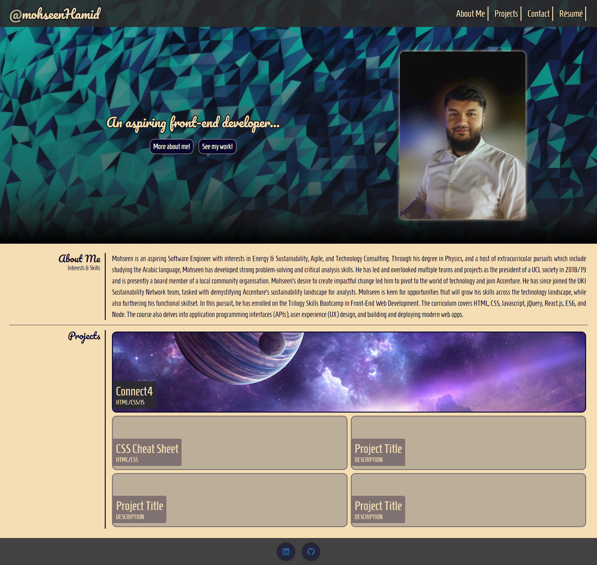

# Week 3 Challenge: Code Bootstrap Portfolio

## Description

Rebuild the professional portfolio webpage In this assignment using the Bootstrap CSS Framework.

## User Story

```
AS A front-end developer
I WANT to build a webpage using the CSS Bootstrap frameworks
SO THAT I can save time by utilising existing designs
```

## Acceptance Criteria

1. The website should include the following bootstrap components:
   - A Navigation bar
   - A hero section (jumbotron featuring picture and name)
   - A work section using Bootstrap grid layout
     - Use bootstrap cards for each project
       - The description should give a brief overview of the work
   - An about / contact section
     - An "About Me" section in the same row
   - A footer section
     - All hyperlinks should have a hover effect
     - All buttons should display a box shadow upon hover
2. The Bootstrap solution should minimize use of media queries

## Usage

This is a static webpage that contains a navigation bar in the header. Click the links to go to the content sections of the page. In the "My Work" section, click on the tiles to be taken to the respective project's GitHub repo.

## Mock-Up

This portfolio webpage includes:

- a header containing a page title + navigation bar
- a hero banner
- a main body containing 2 sections
  1. About Me: a brief professional biography
  2. My Work: a tiled layout of my projects (that can be clicked)
- a footer containing contact info

### Webpage

Please see below screenshots of the webpage:



The following link takes you to the GitHub Pages deployment of the website:

- https://mohseenhamid.github.io/Bootstrap-Portfolio/

## License

Please refer to the LICENSE in the repo.
